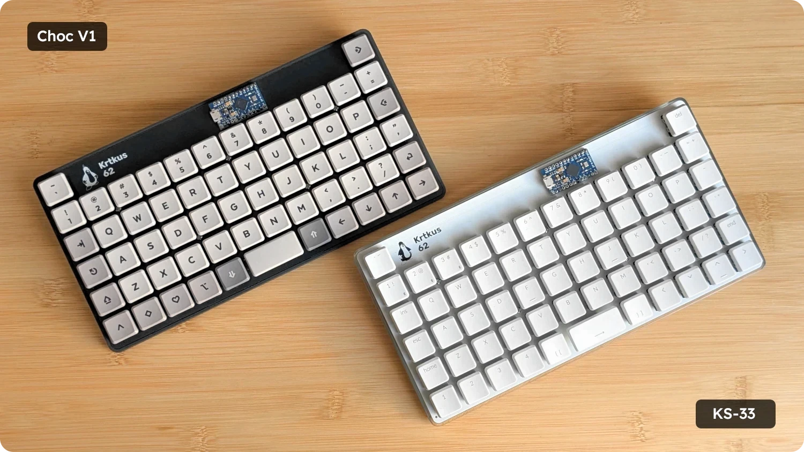
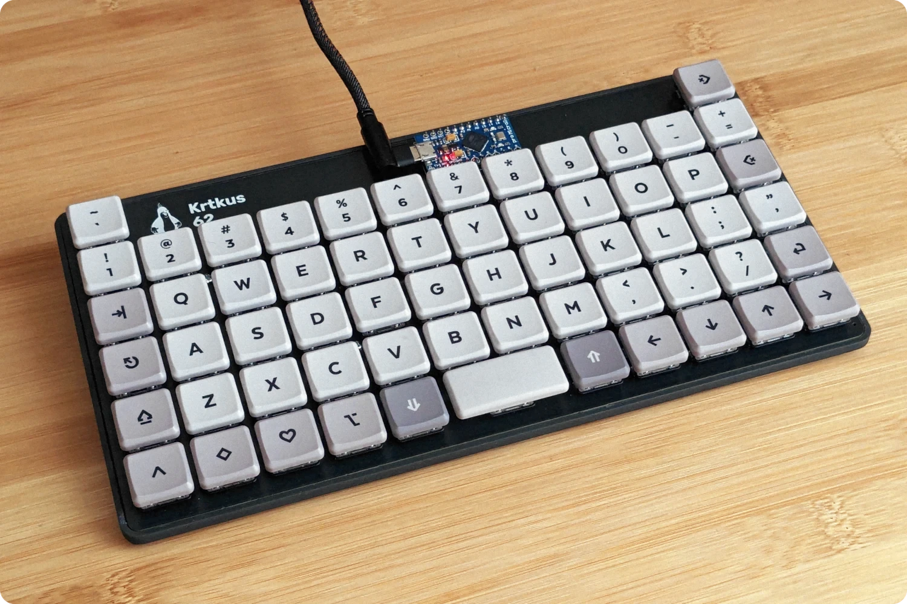
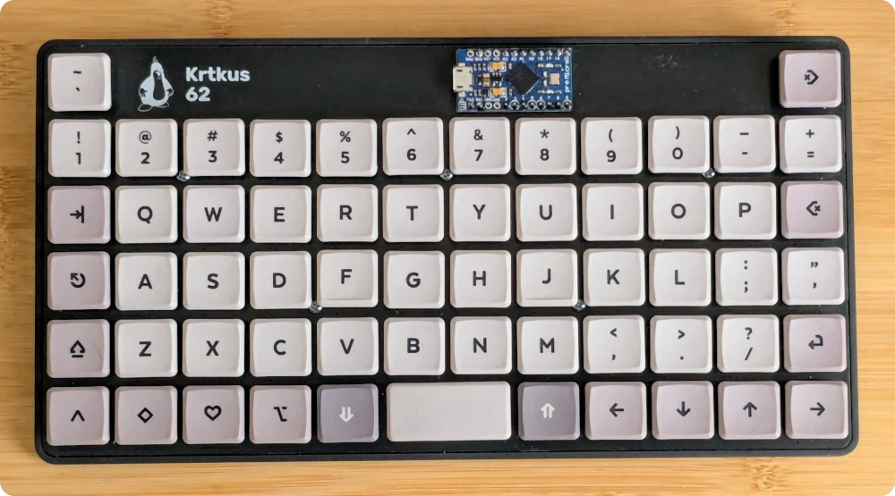
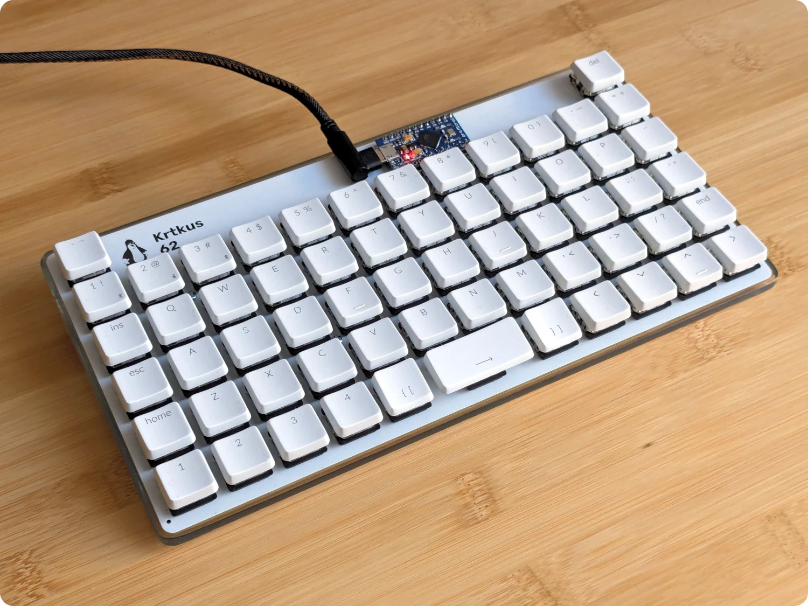
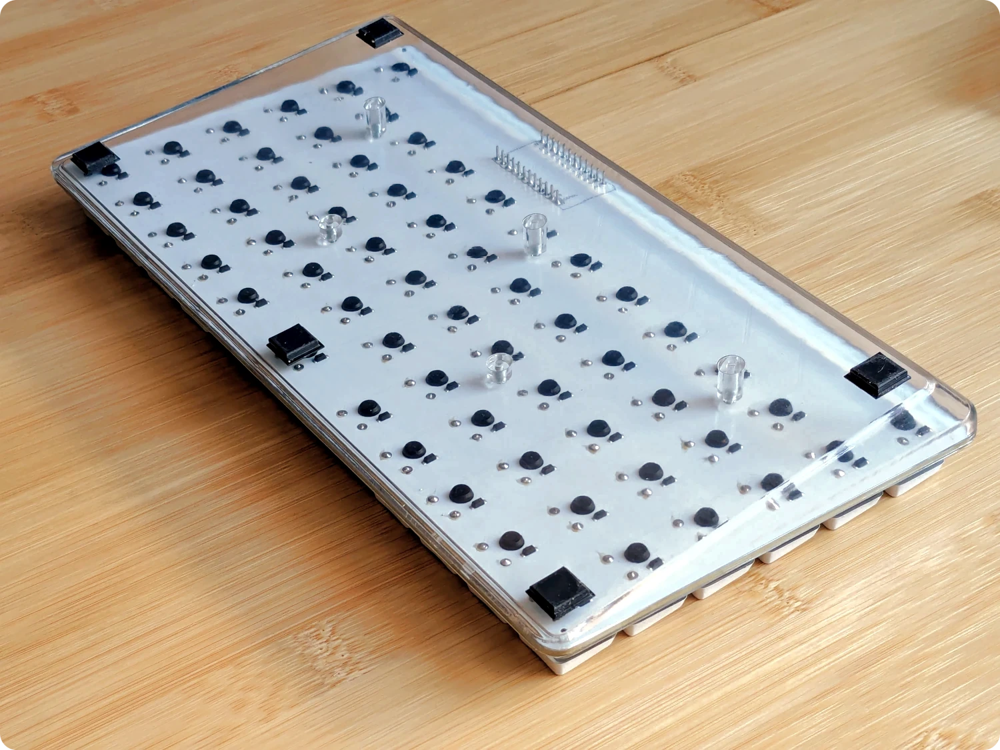

<p align="center">
    <a href="https://raw.githubusercontent.com/swift502/Krtkus/refs/heads/main/images/1.webp"></a>
</p>

# Krtkus

An extended 5x12 keyboard with 2 extra keys. The design is intended for ortho layouts with a shifted number row, allowing for the placement of the delete and tilde keys above their usual spots. PCBs are designed in Kicad, case in Blender.

- Low profile
    - Kailh Choc V1
    - Gateron KS-27/KS-33
- QMK/VIA compatible
- Tray mount
- 3D printed case with a 7 degree tilt

To connect the keyboard to [usevia.app](https://usevia.app), the [design file](production/krtkus_design.json) has to be manually uploaded in the design tab.

## Room for improvement

- Spacebar stabilizer
- Hide MCU on the bottom side and use standard USB port orientation
- Switch plate

## Parts

- One of the PCBs:
    - [Choc V1](production/pcb_choc_v1)
    - [KS-33](production/pcb_ks_33)
- Case: 
    - [STL file](production/krtkus_case.stl)
- Arduino Pro Micro
- 61 SMD diodes
- 61 switches
- 61 keycaps
- 5 M2 x 6mm screws

Optional:

- 90 degree Micro-USB cable
- Rubber feet

## Kicad

### Libraries

- [Scotto Kicad](https://github.com/joe-scotto/scottokeebs/tree/main/Extras/ScottoKicad)
- [MX V2](https://github.com/ai03-2725/MX_V2)
- [Gateron 3D models](https://www.gateron.com/pages/3d)

### Switch grid

| Unit | Offset |
| --- | --- |
| Switch | 19.05 |
| Switch 4 | 4.7625 |
| Switch 16 | 1.190625 |
| Switch 64 | 0.29765625 |

## QMK

- Compiler: https://msys.qmk.fm
- Toolbox: https://qmk.fm/toolbox

On Windows, create a "krtkus" folder in `qmk_firmware/keyboards` and copy the contents of the [qmk folder](source/qmk) inside of it. Then in MSYS compile the firmware using the commands below.

Setup:

```
qmk setup
```

Compile:

```
qmk compile -kb krtkus -km default
```

## Showcase

<p align="center">
    <a href="https://raw.githubusercontent.com/swift502/Krtkus/refs/heads/main/images/2.webp"></a>
    <a href="https://raw.githubusercontent.com/swift502/Krtkus/refs/heads/main/images/3.webp"></a>
    <a href="https://raw.githubusercontent.com/swift502/Krtkus/refs/heads/main/images/4.webp"></a>
    <a href="https://raw.githubusercontent.com/swift502/Krtkus/refs/heads/main/images/5.webp"></a>
</p>