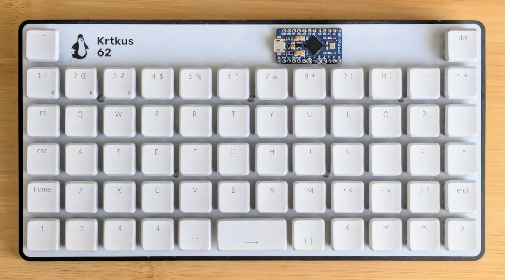
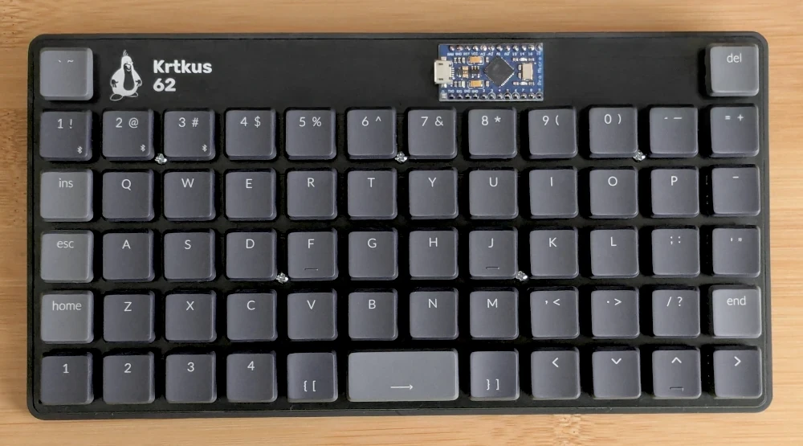

# Krtkus

An extended 5x12 keyboard with 2 extra keys. The design is intended for ortho layouts with a shifted number row, allowing for the placement of the delete and tilde keys above their usual spots. PCBs are designed in Kicad, case in Blender.

- Low profile
    - Kailh Choc V1
    - Gateron KS-27/KS-33
- QMK/VIA compatible
- Tray mount
- 3D printed case with a 7 degree tilt
- 236mm × 122mm × 30mm

Connecting the keyboard to [usevia.app](https://usevia.app) requires manually uploading the [design file](production/krtkus_via.json) in the design tab.


## Parts

- One of the PCBs:
    - [Choc V1](production/pcb_choc_v1)
    - [KS-33](production/pcb_ks_33)
- Case: 
    - [STL file](production/krtkus_case.stl)
- Arduino Pro Micro
- 61 SMD diodes
- 61 switches
- 61 keycaps
- 5 M2x6mm screws

#### Optional:

- 90 degree Micro-USB cable
- Rubber feet

## Room for improvement

- Spacebar stabilizer
- Num/Caps indicators
- LED matrix
- Hotswap version
- Standard USB port orientation

## My builds

| Board | Keycaps | Switches | Case | Firmware |
| --- | --- | --- | --- | --- |
| <a href="https://raw.githubusercontent.com/swift502/Krtkus/refs/heads/main/images/build_1.webp"></a> | MBK Legend Ergo/Ortho | Choc V1 Brown | Black Resin | Caterina |
| <a href="https://raw.githubusercontent.com/swift502/Krtkus/refs/heads/main/images/build_3.webp"></a> | Keychron LSA ABS | KS-33 Brown | Black Resin | Caterina |
| <a href="https://raw.githubusercontent.com/swift502/Krtkus/refs/heads/main/images/build_2.webp"></a> | Keychron LSA ABS | KS-33 Red | 9600 Resin | Caterina (Legacy) |
| <a href="https://raw.githubusercontent.com/swift502/Krtkus/refs/heads/main/images/build_4.webp"></a> | Dell AT101W | KS-33 Banana | [Krtkus Retro](https://github.com/swift502/KrtkusRetro) | Caterina |

## QMK

Standard QMK setup except for `"tap_keycode_delay": 40`, which fixes ignored taps in some games where input scanning is tied to frame rate. To the best of my knowledge, keeping this value above 33ms (30fps) should cover all edge cases.

### Documentation

- `info.json` reference: https://docs.qmk.fm/reference_info_json
- Keycodes: https://docs.qmk.fm/keycodes

### Compiling (Windows)

- Python: https://www.python.org/
- MSYS: https://msys.qmk.fm
- Toolbox: https://qmk.fm/toolbox

Run the compile script:

```sh
python qmk_compile.py
```

### Resetting

Once the firmware is flashed, it provides key combinations to enter bootloader or clear the keyboard's persistent storage.

- <kbd>LShift</kbd> + <kbd>RShift</kbd> + <kbd>B</kbd> - Puts the keyboard into bootloader mode for flashing
- <kbd>LShift</kbd> + <kbd>RShift</kbd> + <kbd>C</kbd> - Clears EEPROM and reverts to the default keymap

## Kicad 8

### Libraries

Below is a list libraries included in the project. These libraries are not licensed under CC0. Please refer to each specific library for licensing details.

- [Scotto Kicad](https://github.com/joe-scotto/scottokeebs/tree/main/Extras/ScottoKicad)
- [MX V2](https://github.com/ai03-2725/MX_V2)
- [Gateron 3D models](https://www.gateron.com/pages/3d)

### Switch grid

| Unit | Offset |
| --- | --- |
| Switch | 19.05 |
| Switch 4 | 4.7625 |
| Switch 16 | 1.190625 |
| Switch 64 | 0.29765625 |
