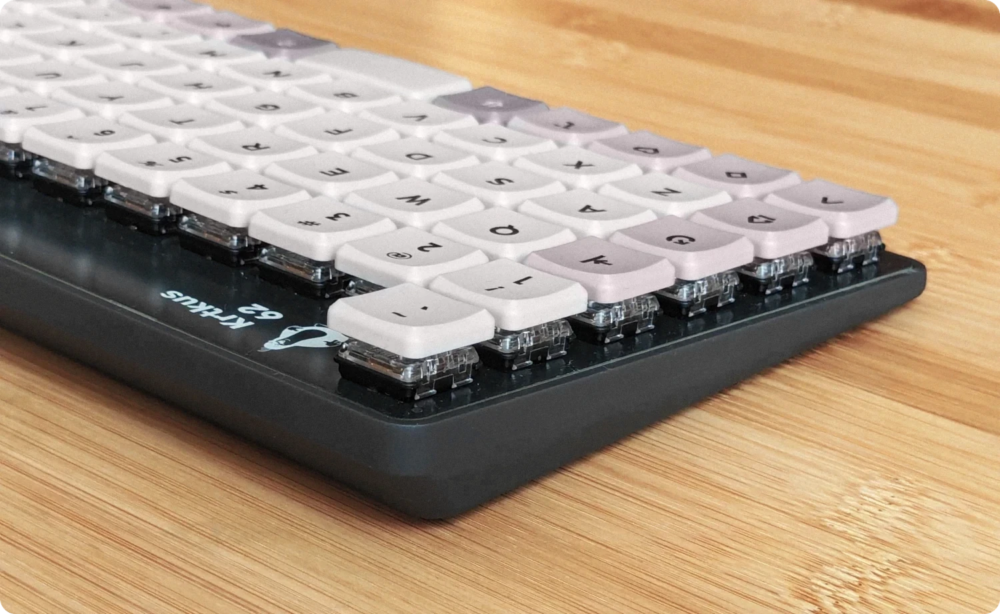

<p align="center">
    <a href="https://raw.githubusercontent.com/swift502/Krtkus/refs/heads/main/images/1.webp"></a>
</p>

# Krtkus

An extended 5x12 keyboard with 2 extra keys. The design is intended for ortho layouts with a shifted number row, allowing for the placement of the delete and tilde keys above their usual spots. PCBs are designed in Kicad, case in Blender.

- Low profile
    - Kailh Choc V1
    - Gateron KS-27/KS-33
- QMK/VIA compatible
- Tray mount
- 3D printed case with a 7 degree tilt
- TODO: Dimensions

To connect the keyboard to [usevia.app](https://usevia.app), the [design file](production/krtkus_design.json) has to be manually uploaded in the design tab.

<p align="center">
    <a href="https://raw.githubusercontent.com/swift502/Krtkus/refs/heads/main/images/2.webp"></a>
</p>

## My builds

| No. | Image | Keycaps | Switches | Case | Pinout | Bootloader |
| --- | --- | --- | --- | --- | --- | --- |
| #1 |  | MBK Legend Ergo/Ortho | Choc V1 Brown | Black Resin | Standard | Caterina |
| #2 |  | Keychron LSA ABS | KS-33 Brown | JLC Black Resin | Legacy | Caterina |
| #3 |  | Keychron LSA PBT | KS-33 Red | 9600 Resin | Legacy | Caterina |
| #4 |  | Keychron LSA ABS | KS-33 Brown | Black Resin | Standard | Atmel DFU |

## Room for improvement

- Missing spacebar stabilizer
- Hide MCU on the bottom side and use standard USB port orientation
- Switch plate

## Parts

- One of the PCBs:
    - [Choc V1](production/pcb_choc_v1)
    - [KS-33](production/pcb_ks_33)
- Case: 
    - [STL file](production/krtkus_case.stl)
- Arduino Pro Micro
- 61 SMD diodes
- 61 switches
- 61 keycaps
- 5 M2 x 6mm screws

Optional:

- 90 degree Micro-USB cable
- Rubber feet

## Kicad

### Libraries

Below is a list libraries included in the project. These libraries are not licensed under CC0. Please refer to each specific library for licensing details.

- Scotto Kicad: https://github.com/joe-scotto/scottokeebs/tree/main/Extras/ScottoKicad
- MX V2: https://github.com/ai03-2725/MX_V2
- Gateron 3D models: https://www.gateron.com/pages/3d

### Switch grid

| Unit | Offset |
| --- | --- |
| Switch | 19.05 |
| Switch 4 | 4.7625 |
| Switch 16 | 1.190625 |
| Switch 64 | 0.29765625 |

## QMK

### Documentation

- `info.json` reference: https://docs.qmk.fm/reference_info_json

### Compiling (Windows)

- MSYS: https://msys.qmk.fm
- Toolbox: https://qmk.fm/toolbox
- Python: https://www.python.org/

Run the compile script:

```sh
python qmk_compile.py
```

### Resetting

Once the firmware is flashed, it provides key combinations to enter bootloader or clear the keyboard's persistent storage.

- `LShift + RShift + B` - Puts the keyboard into bootloader mode for flashing
- `LShift + RShift + C` - Reinitializes the keyboard and reverts to the default keymap
